# Lomnov-LandingPage

**Name:** Cheng ChayLim  
**Project:** Lomnov - Landing Page  

**Git Live Demo Link:** https://chaylimm.github.io/Lomnov-LandingPage/  

---

## Screenshots

### Desktop Views
- **Navigation Bar & Hero section**  
  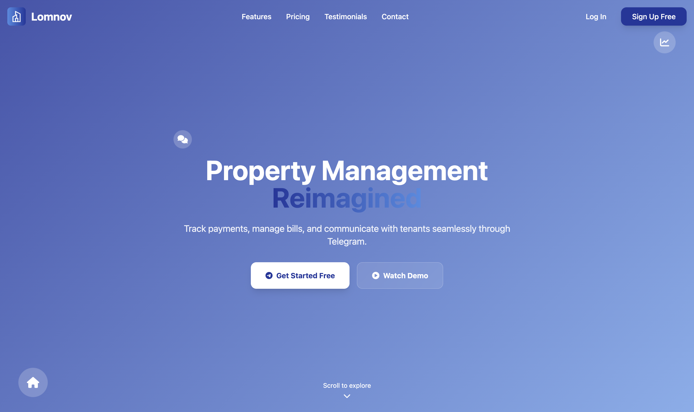

- **"Why VibeFlow" Section**  
  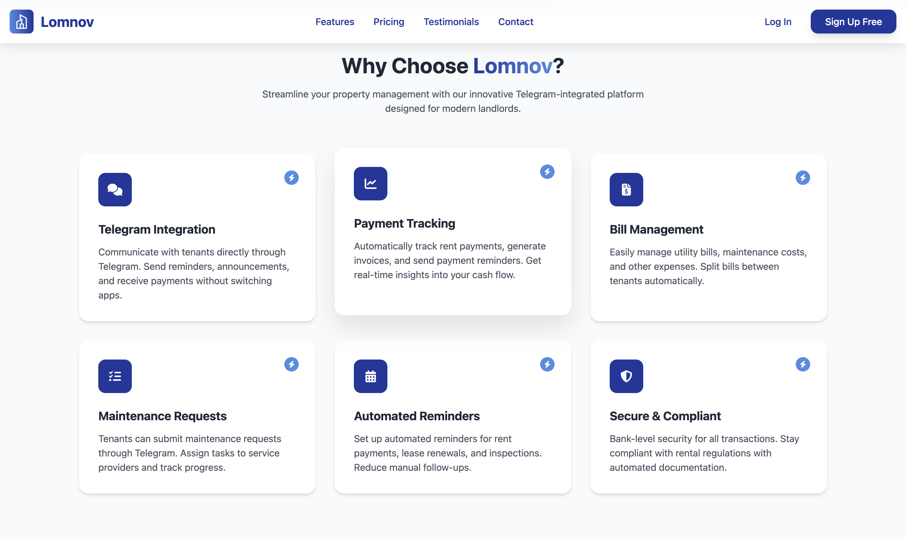

- **Pricing Section**  
  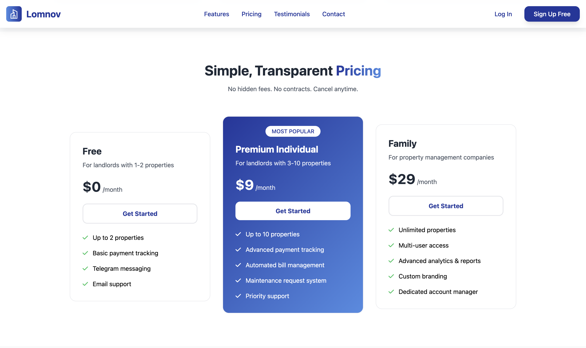

- **Testimonials Section**  
  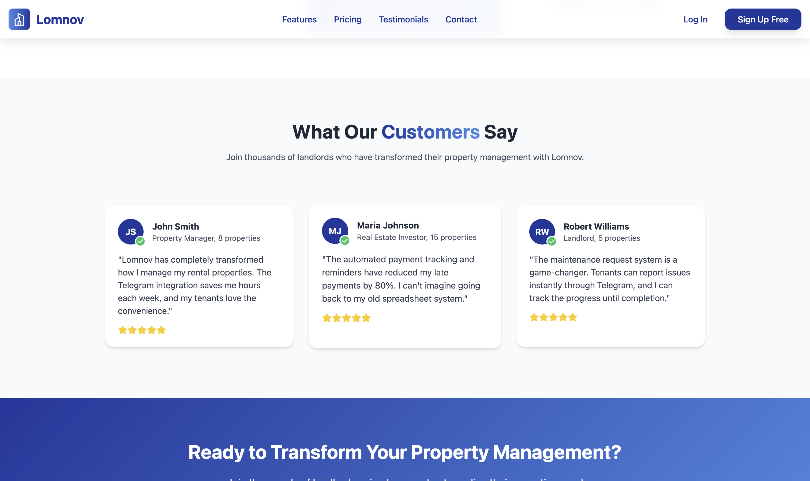

- **Footer**  
  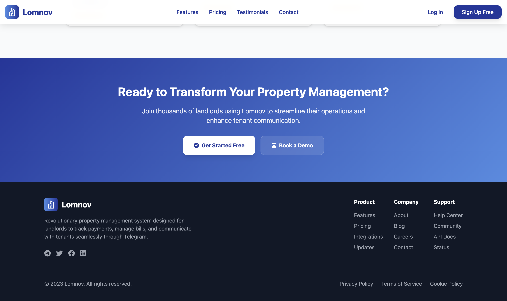

### Mobile Views
- **Navigation Bar & Hero section**  
  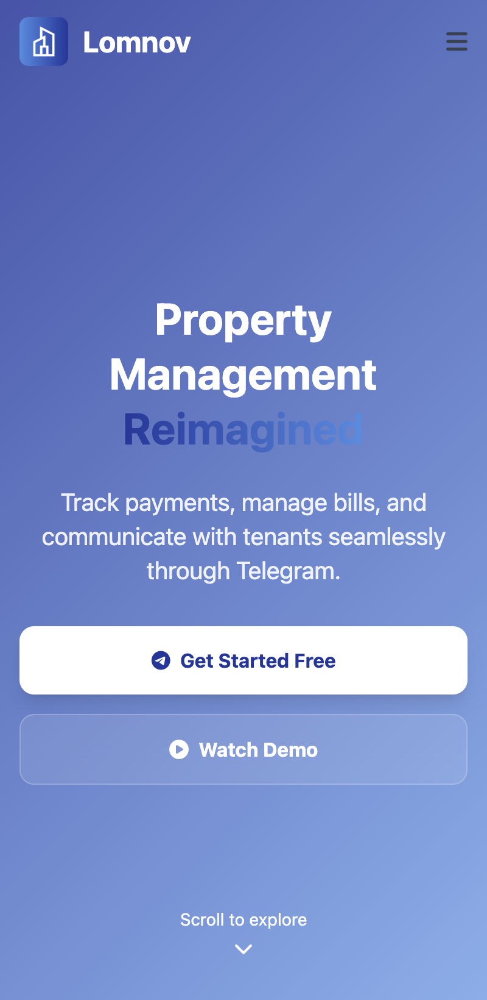

- **"Why VibeFlow" Section**  
  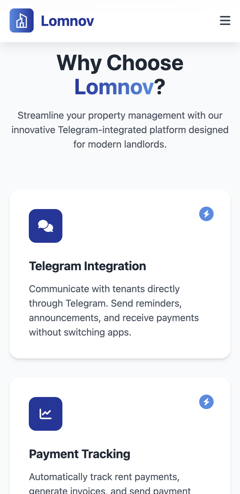

- **Pricing Section**  
  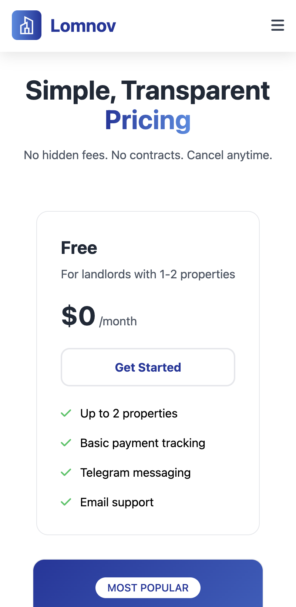  
  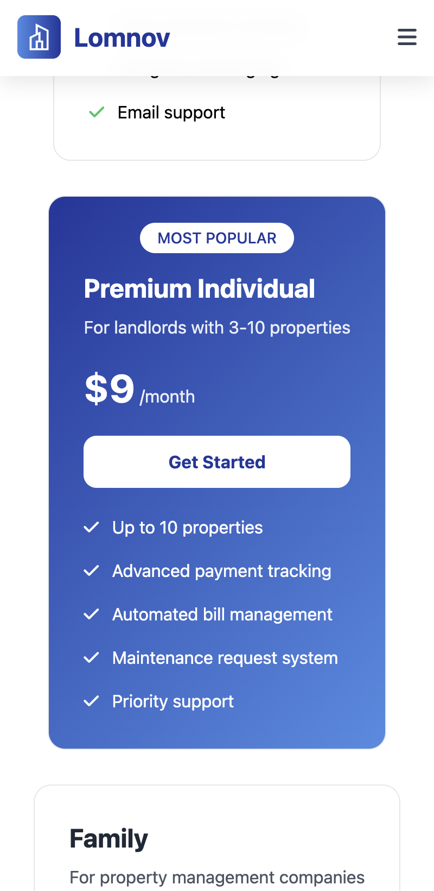

- **Testimonials Section**  
  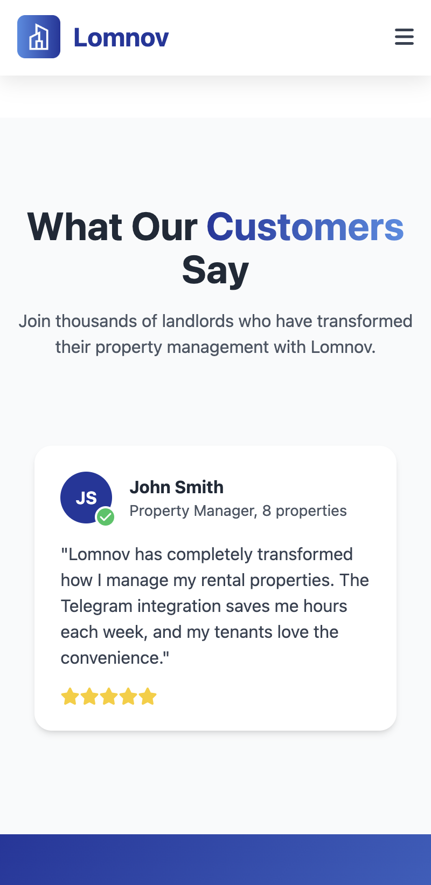

- **Footer**  
  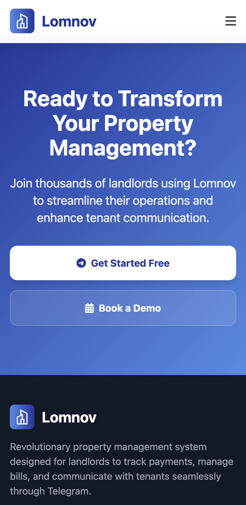  
  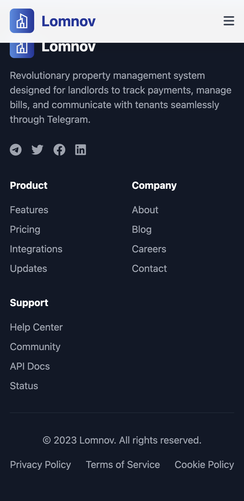

---

## List of Implemented Features
- Carousel
- Smooth scrolling
- Nav Background transform when scrolling

---
# Credits

## Assets & Resources

- **Icons**: [Font Awesome](https://fontawesome.com/) 6.4.0
- **Font**: [Inter](https://fonts.google.com/specimen/Inter) from Google Fonts  
- **CSS Framework**: [Tailwind CSS](https://tailwindcss.com/)
- **Logo**: Custom asset (`lomnov-logo.png`) by Cheng ChayLim

## Attribution
Icons by Font Awesome, Font by Inter from Google Fonts.
---

## How to Run the Project Locally
1. Install Node.js (v16.20.2)
2. Run `npm run start`